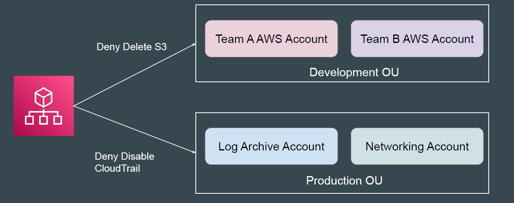

# Organizational Units (OUs) in AWS Organizations

## Setting the Base

Large organizations may manage hundreds of AWS accounts.
Applying policies to accounts — such as those used for development — can be complex
and difficult to manage if not grouped together.
Example: Attach “DenyS3” SCP to all Development Accounts.

## Introducing Organizational Units

An Organizational Unit (OU) allows customers to to group AWS accounts.
You can apply policies at OU level.

## Point to Note

You can create multiple OUs within a single organization, and you can create
OUs within other OUs.

