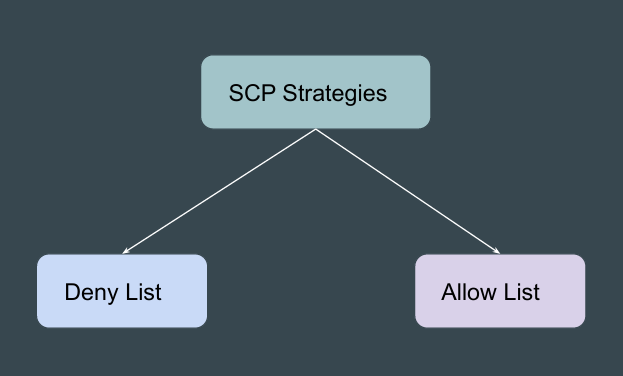
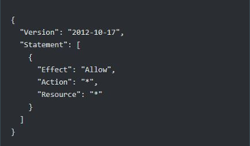
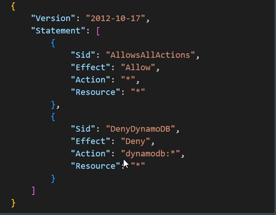
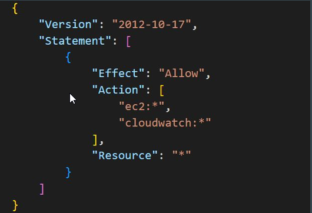

# Strategies for using SCPs

## Understanding the Basics

There are two strategies that you can use to configure SCPs in your account.

## Strategy 1 - Deny List

In deny list, actions are allowed by default, and you specify what services and 
actions are prohibited.

To support this, AWS Organizations attaches an AWS managed SCP named 
FullAWSAccess to every root and OU when it's created.

## Benefits of Deny List Strategy

Using a deny list strategy, account administrators can delegate all services and 
actions until you create and attach an SCP that denies a specific service or set 
of actions.

Deny statements require less maintenance, because you don't need to update 
them when AWS adds new services.

Deny statements usually use less space, thus making it easier to stay within the 
maximum size for SCPs

## Sample Deny List Based Policy

## Strategy 2 - Allow List

To use SCPs as an allow list, you must replace the AWS managed 
FullAWSAccess SCP with an SCP that explicitly permits only those services and 
actions that you want to allow.

By removing the default FullAWSAccess SCP, all actions for all services are now 
implicitly denied.

Your custom SCP then overrides the implicit Deny with an explicit Allow for only 
those actions that you want to permit.

##  Sample Allow List Based Policy

## Points to Note
Every root, OU, and account must have at least one SCP attached.

If you want to replace the default FullAWSAccess policy with an SCP that limits 
the permissions that can be delegated, you must attach the replacement SCP 
before you can remove the default SCP