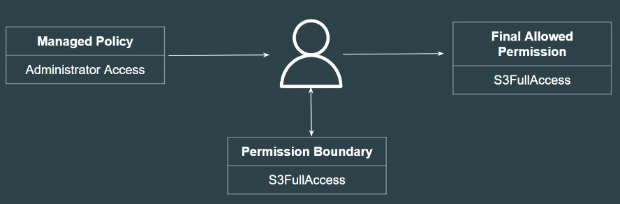

## Simple Analogy
 

Imagine a parent telling a child:

> "You are allowed to play anywhere."

A **Permission Boundary** is like a physical fence around the playground. 
Even if the parent says, *"You can play anywhere,"* the child cannot physically go beyond the fence.

## Setting the Base

A **Permissions Boundary** is an advanced feature that uses a managed policy to define the **maximum permissions** that an identity-based policy can grant to an IAM entity.

