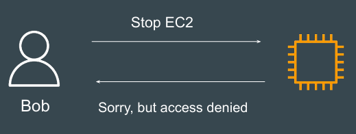
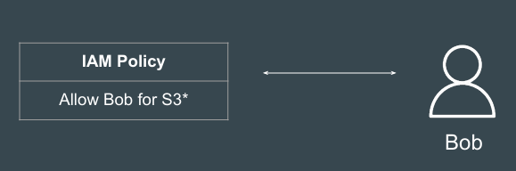
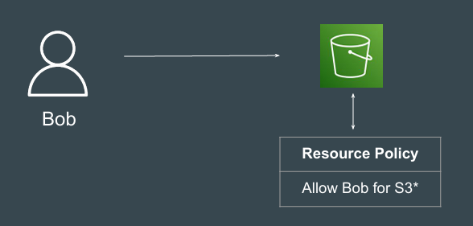
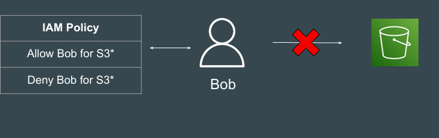
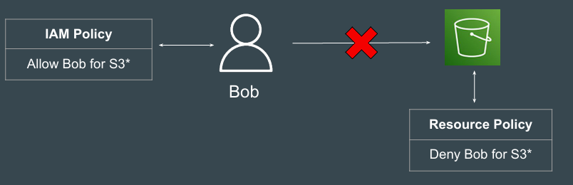
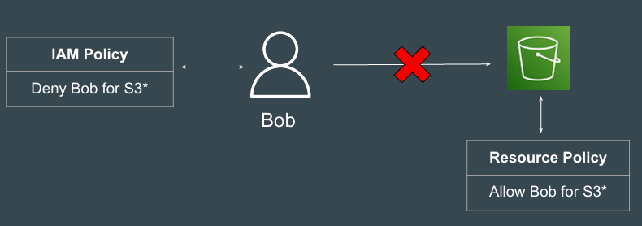
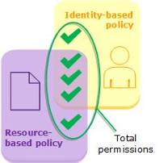
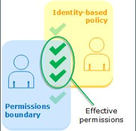
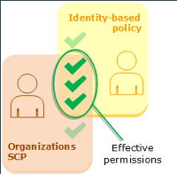
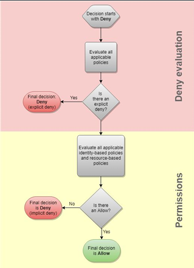

# IAM Policy Evaluation Logic

## Understanding the Challenge

AWS has so many types of IAM Policies available.

IAM Policies: Identity-Based, Resource-Based, SCPs, Sessions Policies, ACLs

Question: When there are contradictory policies, what will be the final decision?

## Basics of Default Deny

By default, all requests are implicitly denied with the exception of the AWS 
account root user, which has full access.

If user does not have any IAM Policy, it means that all his requests will be 
denied by default.

## Overriding Default Deny - Identity Level

An explicit allow in an identity-based or resource-based policy overrides this 
default deny.

## Overriding Default Deny - Resource Level

An explicit allow in a resource-based policy overrides this default deny.

## Allow and Deny Policy

User has both Allow and Deny policies.

Any Explicit Deny = Final Deny

Explicit Deny = 0

Anything multiplied by 0 is 0

## Deny at a Resource Policy Level

An explicit Deny always has higher precedence than explicit allow.

## Explicit Deny is Final Deny - Second

An explicit Deny has higher precedence than explicit allow.

## Evaluating identity-based policies with resource-based policies

When an IAM entity (user or role) requests access to a resource within the same 
account, AWS evaluates all the permissions granted by the identity-based and 
resource-based policies.

The resulting permissions are the total permissions of the two types.

## Evaluating identity-based policies with permissions boundaries

When AWS evaluates the identity-based policies and permissions boundary for a 
user, the resulting permissions are the intersection of the two categories.

## Evaluating identity-based policies with Organizations SCPs

When a user belongs to an account that is a member of an organization, the 
resulting permissions are the intersection of the user's policies and the SCP. 

This means that an action must be allowed by both the identity-based policy and 
the SCP

## Policy Evaluation - Identity and Resource Policies

