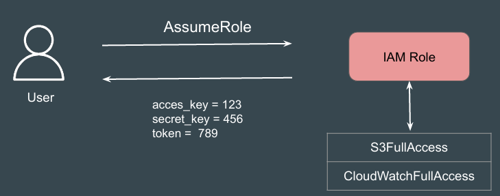
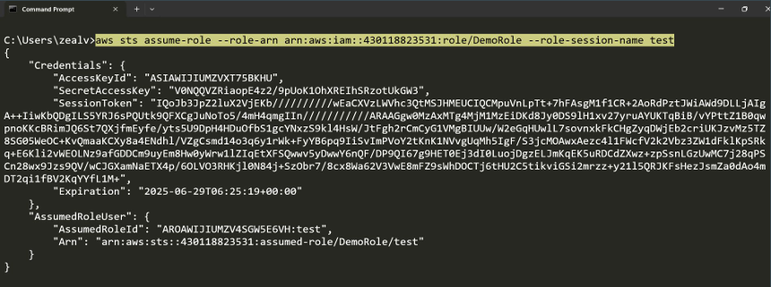
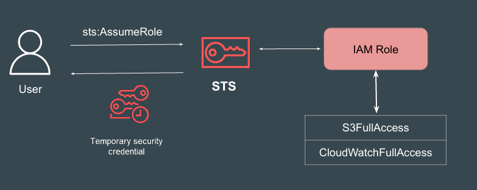
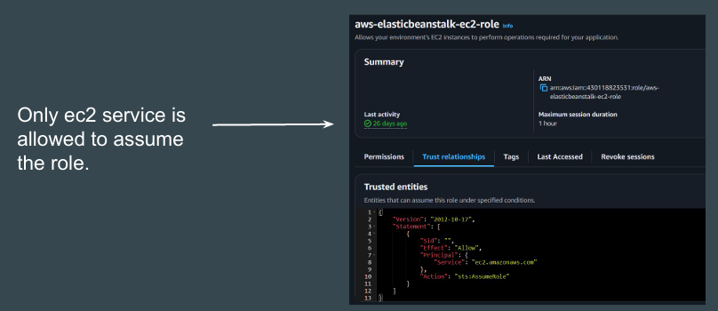
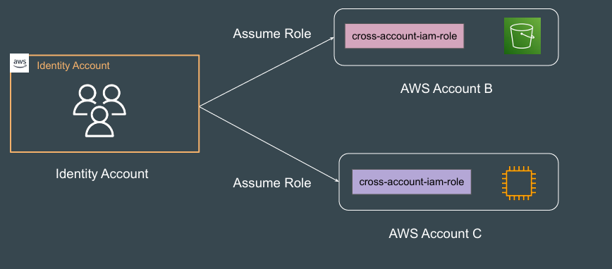

# AWS Secure Token Service (STS)
"Credentials Management"

## Setting the Base
We can perform AssumeRole operation to receive set of temporary credentials 
that you can use to access AWS resources.

These credentials will have same privilege as the IAM Role that is assumed.

## Reference Screenshot - Assume Role

## Security Token Service
STS is the service that makes role assumption possible in AWS by issuing 
temporary credentials when the AssumeRole API is called.

## Importance of Trust Policy
When you create a role, you create a role trust policy that specifies who can 
assume the role

## Cross Account Architectures
User in Account A can assume role in Account B to gain access to resources in 
Account B.

## Summary Workflow

1. An IAM user (or application) calls the AssumeRole API provided by STS, 
specifying the ARN of the role to assume and a session name.

2. STS verifies if the caller is allowed to assume the specified role by checking the 
role's trust policy.

3. If allowed, STS generates a set of temporary security credentials (Access Key 
ID, Secret Access Key, and Session Token) with the permissions defined in the 
assumed role's policy.

4. The caller uses these temporary credentials to access AWS resources, acting as 
the role for the duration of the session.

## Additional Pointers
AWS STS offers several APIs to issue temporary credentials, tailored for various 
use cases:

| AWS STS API Operation | Description |
|-----------------------|-------------|
| `AssumeRole` | AWS principals, such as IAM users or other roles, assume a role in the same or another AWS account. |
| `AssumeRoleWithSAML` | A user authenticates with an external SAML identity provider (IdP), receives a SAML assertion, and presents the assertion to AWS STS to obtain temporary credentials for an AWS role. |
| `AssumeRoleWithWebIdentity` | A user authenticates with a web identity provider (IdP), receives an OIDC token, and presents the token to AWS STS to assume a role. Web identity providers can include Google, Facebook, and Amazon Cognito. |
| `GetSessionToken` | An MFA-enabled IAM user calls `GetSessionToken` and submits an MFA code associated with the user’s MFA device. |
| `GetFederationToken` | Obtains temporary security credentials for a federated user. |