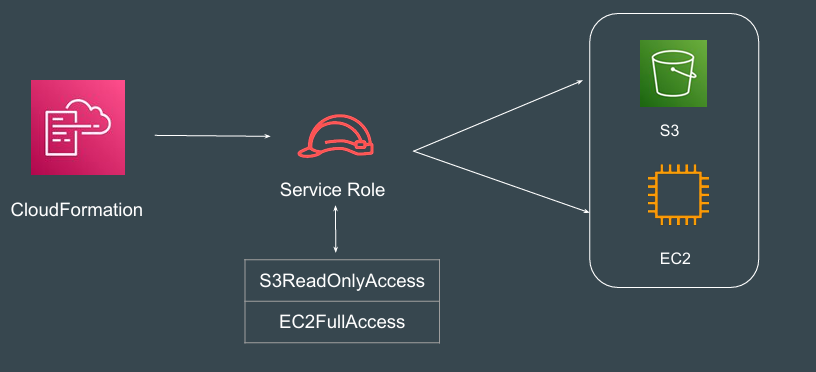
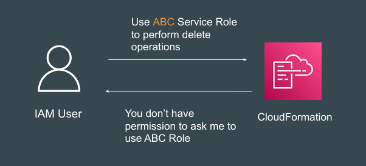
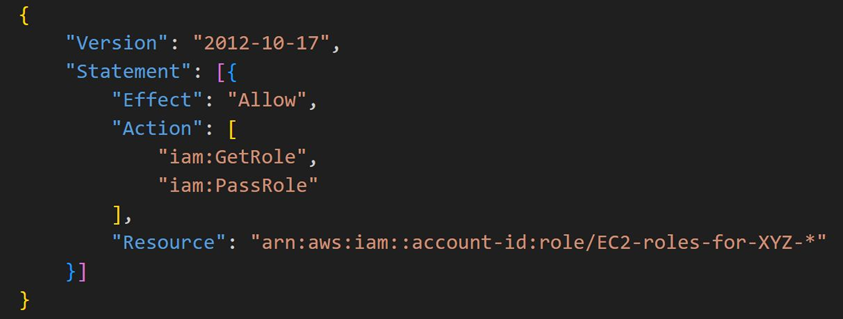
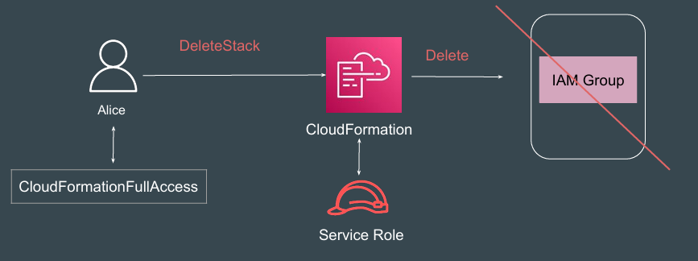

# Service Role and Pass Role

## Overview of Service Roles
A Service Role is an IAM role that an AWS service assumes to perform actions 
on your behalf.

## Overview of Pass Role

PassRole is an IAM permission that controls who can assign roles to AWS 
resources. 
It allows certain IAM principals to pass an existing role to an AWS service.

## Reference Screenshot - IAM Policy for PassRole

## Important Pointer
After a role is associated with a CloudFormation stack, any user who has 
permission to work with that stack can operate that stack, even if they do not 
have permission on the underlying resource.

