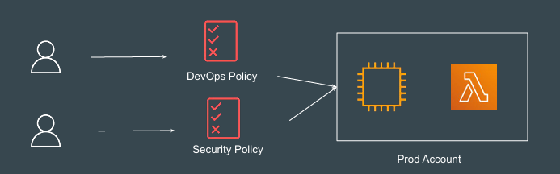
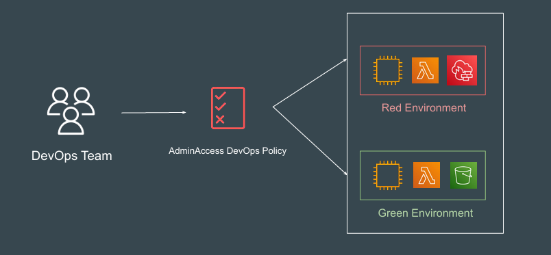
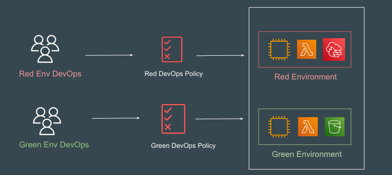
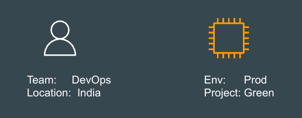
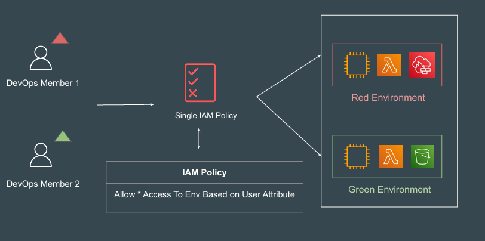
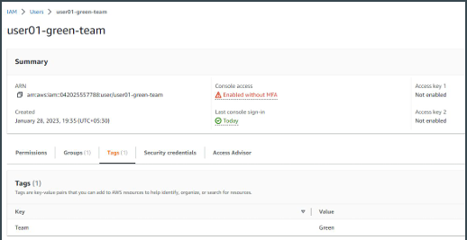
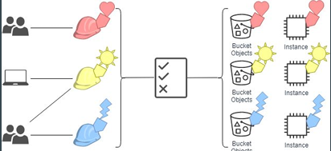
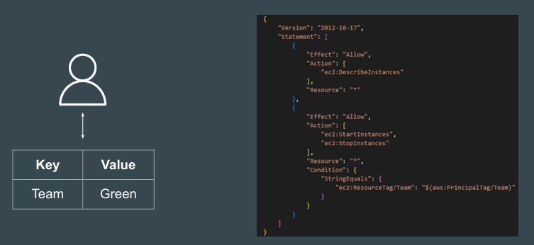

# Attribute-based access control

## Basics of RBAC

Role-based access control (RBAC) restricts access based on a person's role 
within an organization.

In IAM, you implement RBAC by creating different policies for different job 
functions.

## Understanding the Challenge

DevOps Team has access to Red and Green Environment;

## Possible Approach of Separation

Red   -->   Env DevOps only has access to Red Environment
Green -->   Env DevOps only has access to Green Environment

## Basics of Attributes

Attributes are key-value pairs.

In AWS, these attributes are called tags.

## Scalable Permission Model based on Attributes

## Attributes for IAM User

You can use IAM tag key-value pairs to add custom attributes to an IAM user.

## Attribute-Based Access Control

Attribute-based access control (ABAC) is an authorization strategy that defines 
permissions based on attributes.

## Permissions Based on ABAC

This example shows an IAM policy that allows a principal to start or stop an 
Amazon EC2 instance when the instance's resource tag and the principal's tag 
have the same value for the tag key Team

## Benefits of ABAC

ABAC requires fewer policies. Because you don't have to create different 
policies for different job functions, you create fewer policies. Those policies are 
easier to manage.

Permissions can easily be granted and revoked based on user’s tags.

You can even use attributes of users from corporate directory to allow / deny 
permissions to AWS resources.