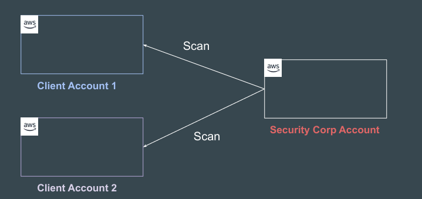
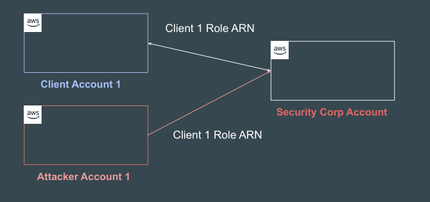
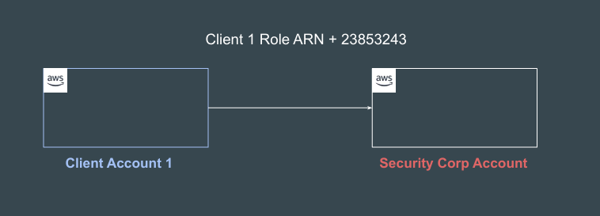
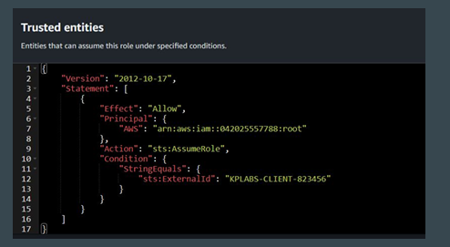

# External ID

## Setting the Base

Security Corp has a SAAS software offering that scans the AWS environment of 
customers and provides regular security recommendations.

<div align="center">

</div>

## How is Access Granted

For Security Corp SAAS software to continuously scan client’s AWS accounts, 
the following steps are required:

1. Client Account needs to create cross-account IAM role to allow Security 
Corp account to access resources.

2. Security Corp assumes that role, scans the resources and provides findings 
in the central dashboard.

## Confused Deputy Problem

The confused deputy problem is a security issue where an entity that doesn't 
have permission to perform an action can coerce a more-privileged entity to 
perform the action.

<div align="center">

</div>

## The Workflow

1. When you start using Security Corp's service, you provide the ARN of 
Client1:ExampleRole to Security Corp.

2. Security Corp assumes this cross account role to gain access to your AWS 
account.

3. Another customer also starts using Security Corp service, and this customer 
also provides Client1:ExampleRole to Security Corp 

4. Security Corp assumes this Client1:ExampleRole on behalf of Customer 2 
and shares also security related findings with Customer 2.

## Introducing External ID

External ID is used along with the Role ARN to be able to assume it.
This acts as an additional verification check and must match to assume role.

<div align="center">

</div>

## Points to Note

Security Corp must generate an unique ExternalId value for each customer. 

The ExternalId value must be unique among Security Corp's customers and 
controlled by Security Corp, not its customers.

## IAM Policy with External ID
Security Corp gives the external ID value of 12345 to you.

You must then add a Condition element to the role's trust policy that requires the 
sts:ExternalId value to be 12345, like this:

<div align="center">

</div>

## CLI Document Referenced:

https://docs.aws.amazon.com/cli/latest/reference/sts/assume-role.html

Sample Command:
```
aws sts assume-role --role-arn arn:aws:iam::123456789012:role/xaccounts3access --role-session-name s3-access-example

```