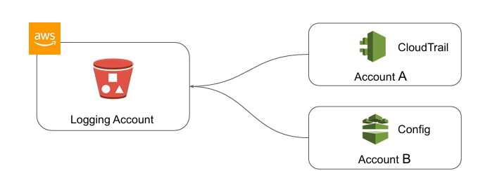
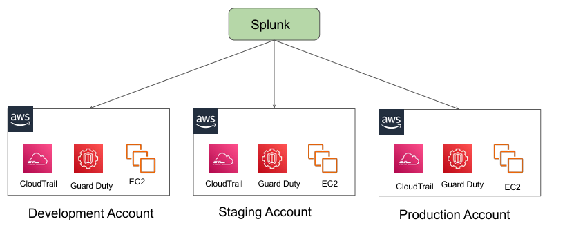
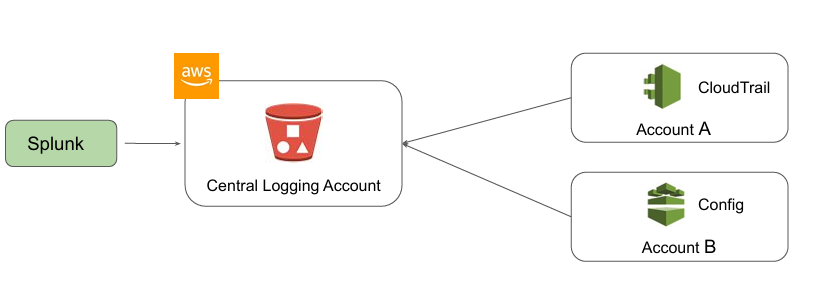

# Centralized Logging 
"Architectural Perspective"

## 
  
A comprehensive log management and analysis strategy is mission critical in an organization.
It enables the organizations to understand the relationship between operational, security, 
and change management events and maintain a comprehensive understanding of their 
infrastructure.

## Challenges with Logging

In a Multi-Account based architecture, log monitoring at an individual account level is not 
the best of the approaches.

## Recommended Architecture for Logging
  
A comprehensive log management and analysis strategy is mission critical in an organization.
One of the recommended approaches is to use a Centralized Logging Account.

## Considerations while implementing Logging

Define log retention requirements and lifecycle policies early on.

Incorporate tools and features to automate the lifecycle policies.

Automate the installation and configuration of log shipping agent.

Make sure the solution supports hybrid environment to support the needs.

## AWS Services to Help!

We can make use of AWS Managed service to build centralized logging solutions.
Services which can help here:

● AWS ElasticSearch Service

● AWS CloudWatch Logs

● Kinesis Firehose

● AWS S3

Ways to configure centralized logging for each AWS service (CloudTrail, VPCFlow) differs.
