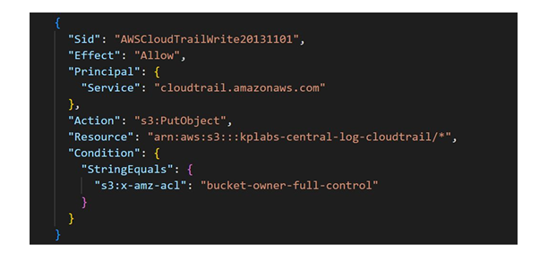
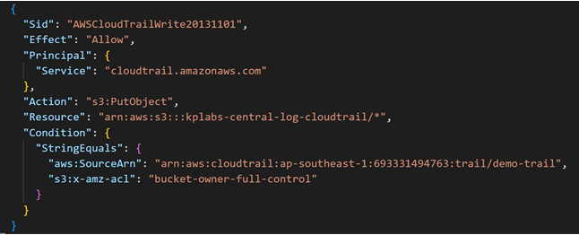

# Considerations - S3 Bucket Policy for Cross-Account

## Challenges with S3 Bucket Policy

A wildcard based S3 bucket policy allowing CloudTrail service would mean that any AWS 
account’s CloudTrail can put its data to your S3 bucket.

## Bucket Policy with Conditional Statement

As a security best practice, add an aws:SourceArn condition key to the Amazon S3 bucket 
policy. This helps prevent unauthorized access to your S3 bucket.

