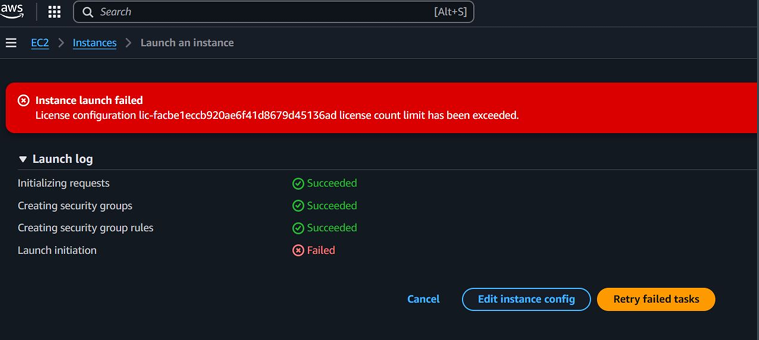

#  AWS License Manager

## Understanding the Challenge

Organizations often use many commercial softwares (like Microsoft, Oracle, 
SAP, etc.) that requires software licenses. 

In the Cloud, new servers can be launched with a click of a button, and there 
can be hundreds of AWS accounts.

License Violations detected during audits can lead to severe penalties.

## Setting the Base

AWS License Manager is a service which allows us to manage licenses from a 
wide variety of software vendors across AWS and on-premises.

We can enforce policies for licenses based on various factors like CPU, sockets, 
etc that will control the number of EC2 instance that can be launched.

## Key Features

| Important Features | Description |
|:------------------:|:-----------:|
| License Configuration | Define vendor, product, number of licenses, metric (per core, per socket, per user). |
| Automated Discovery | Integrates with AWS Systems Manager (Inventory) to auto-detect software usage. |
| Cross-Account Management | Manage licenses across multiple AWS accounts (using AWS Organizations). |
| Reporting & Auditing | Generate detailed reports for audits, renewals, or optimization. |

## Reference Screenshot

The error below occurs when a user tries to launch an EC2 instance based on 
software whose license count limit has been exceeded.

