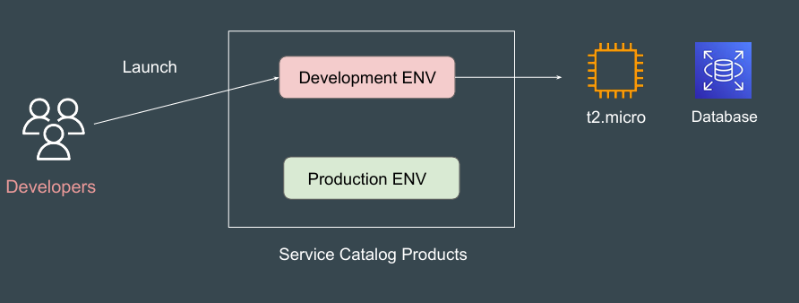
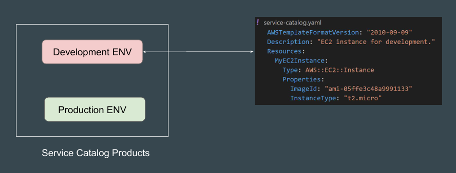
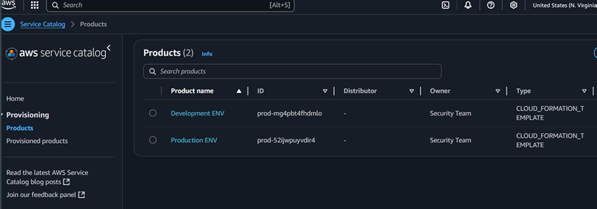
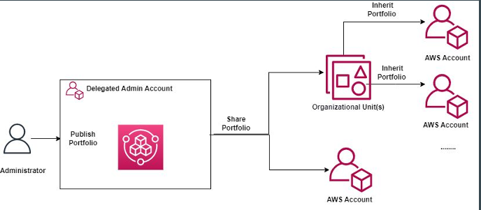

# AWS Service Catalog

## Understanding the Challenge

Teams often create and configure cloud resources manually, leading to 
inconsistent setups, configurations, and security issues.

Most of the time, resources are over-provisioned, which increases the costs.

## Introducing Service Catalog

AWS Service Catalog enables organizations to create and manage catalogs of 
IT services that are approved for use on AWS.

## How it Works

AWS Service Catalog products are typically defined using AWS CloudFormation 
templates, which specify the AWS resources and configurations to be 
provisioned when a user launches the product.

## Workflow Example

1. User selects a product in the Service Catalog.

2. Service Catalog reads the associated CloudFormation template.

3. Service Catalog creates a new CloudFormation stack in the user’s account, 
passing in any parameters the user provided.

4. CloudFormation provisions the resources (instances, databases, etc.) as 
described in the template.

5. Service Catalog monitors the stack and updates the user on progress or 
errors.

## Reference Screenshot

The screenshot displays the Products a user can use to launch infrastructure.

## Sharing Portfolio

You can share your Portfolio with other AWS accounts as well as within AWS 
organizations.

## Point to Note - Integrations

AWS Service Catalog can integrate with external platforms like Service Now.

ServiceNow users can natively browse and provision AWS Service Catalog 
products created with AWS Launch Wizard by using the AWS Management 
Connector for ServiceNow.