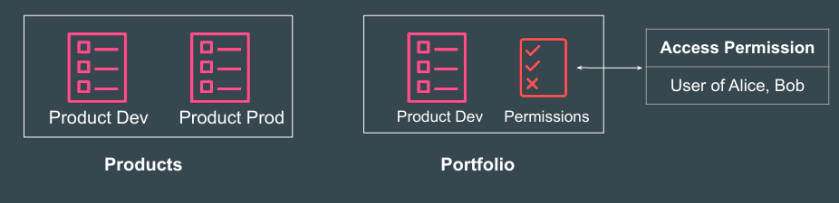
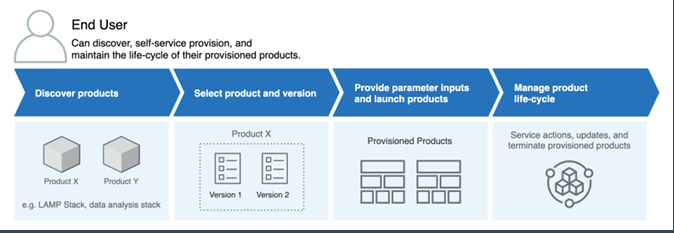
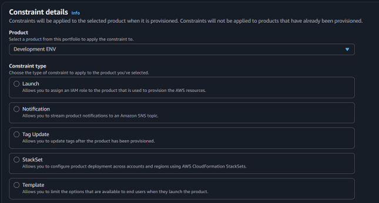
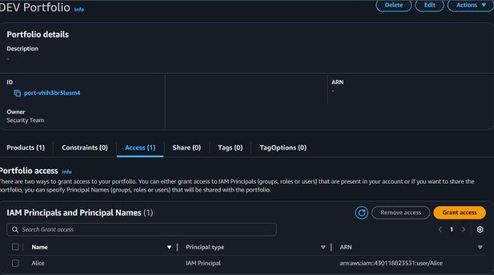
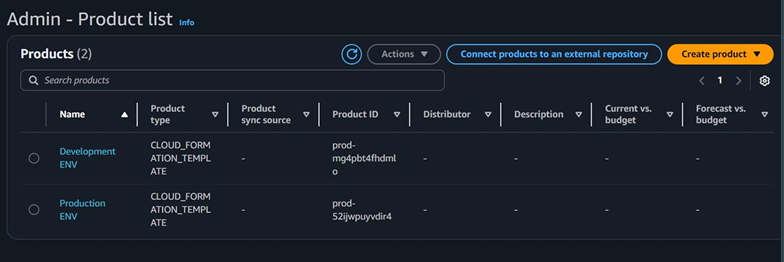

#  Important Concepts - AWS Service Catalog

## Important Concept - Product and Portfolio

A Product is a blueprint for deploying AWS resources. It is typically a 
CloudFormation template (or Terraform, etc.) that defines the infrastructure you 
want to provision.

A Portfolio is a collection of products, plus configuration related to access 
permissions, constraints, sharing, tags.

## End User Workflow

1. End user will be able to see list of Products they have access to.
2. Based on requirement, end user can launch the product.

## Constraints

We can apply constraints to control the rules that are applied to a product in a 
specific portfolio when the end users launches it.

## Reference Screenshot - Portfolio 
The screenshot displays Portfolio where Alice user has access to the associated 
products.

## Reference Screenshot - Portfolio 

The screenshot displays two products based on type of 
CLOUDFORMATION_TEMPLATE

