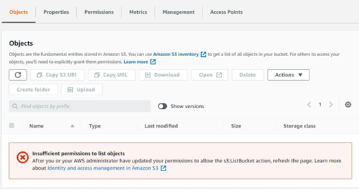
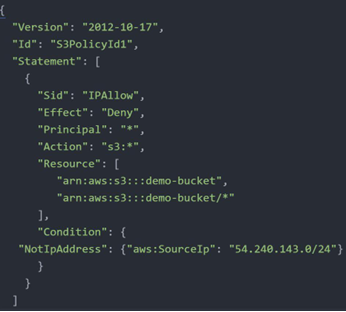

# Regaining Access to Locked S3 Bucket

## Lockout of S3 Bucket

With a S3 Bucket policy that is configured incorrectly, all the IAM users can be locked out.

## Bucket Policy - Restriction by IP

Only allow request from a specific IP Address.

## Important Note

Wrong set of S3 Bucket policy will lead to you being locked out of S3 bucket.

In order to regain the control of S3 bucket, login with ROOT user and delete the Bucket 
Policy.