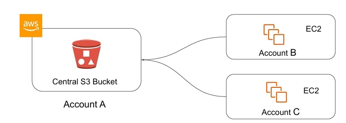
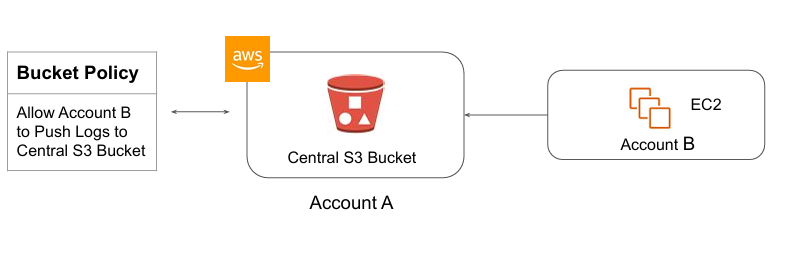
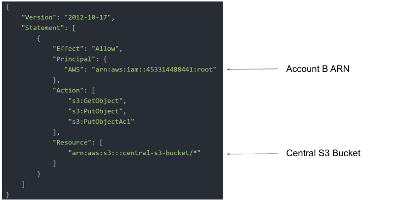
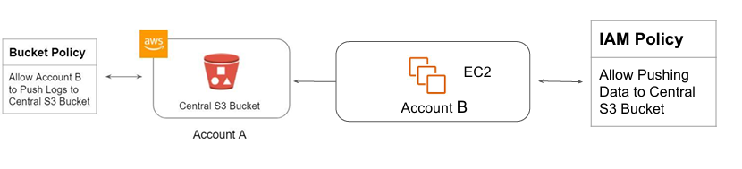
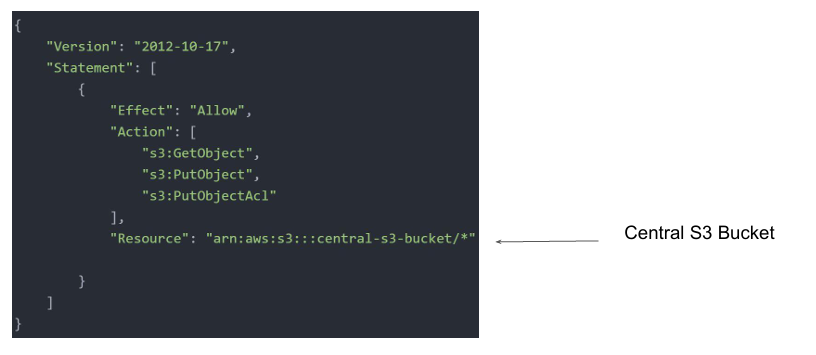

# Cross Account S3 Access

  
There are many requirements where logs across all AWS accounts need to be stored in a central 
account.

These logs can include, CloudTrail, CloudWatch, Application Logs, and others.

## Creating Bucket Policy

The recommended approach is to add a Bucket Policy in the Central S3 bucket and allow the 
Account B to push the logs

## Bucket Policy Example - Central S3 Account

## Part 2- Permission on Account B Side

The resource in the Account B also needs to have permission to push the logs to Central 
Account S3 Bucket.

## IAM Policy - Account B 

