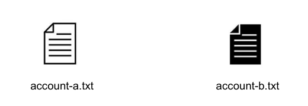
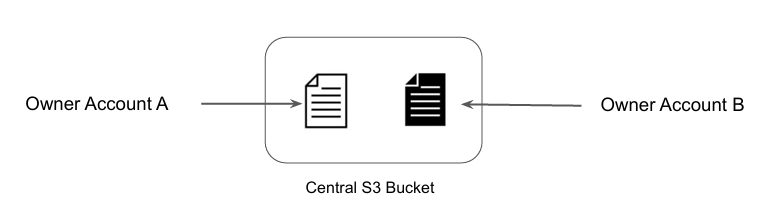
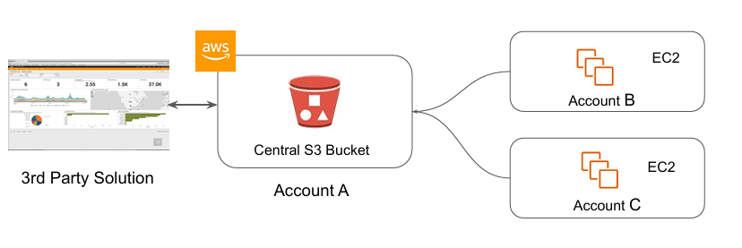

# Canned ACL 

## Understanding S3 Access ACL
Every bucket and it’s objects have an ACL associated with them.

When a request is received, AWS S3 will check against the attached ACL to either allow or 
block access to that specific object.

## The Tricky Part

When we create a bucket or an object, AWS S3 by default will grant the resource owner full 
control over the resource.

## Ideal Architecture

In most of the architectures, 3rd Party Log Monitoring / SIEM solutions connect to the 
Central S3 bucket to fetch all of the data.

## Canned ACL 

AWS S3 supports set of pre-defined grants, known as Canned ACL’s.

Each canned ACL has predefined set of permission associated with them.

These canned ACL can be specified in the request using x-amz-acl header.

| ACL Name | Description |
|---|---|
| Private | Owner gets FULL_CONTROL. No one else will have access rights (default). |
| Public-read | Owner has FULL_CONTROL. All others will have public read permission. |
| Bucket-owner-read | Owner of the object has FULL_CONTROL. Bucket owner will get read permissions. |
| Bucket-owner-full-control | Both the object owner and the bucket owner get FULL_CONTROL over the object. |