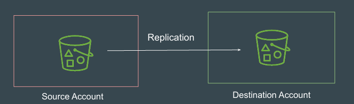
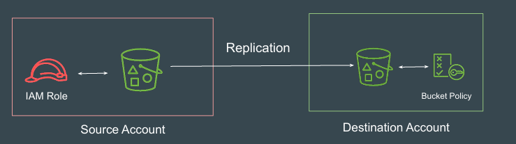

# S3 - Cross Account Replication

## Understanding the Basics
Replicating Data across different S3 Buckets in same account is a 
straightforward process.

However for requirements were Source and Destination Bucket are in different 
account, there are additional configurations that are needed.

## End to End WorkFlow Steps

1. IAM Role in the Source Account is required with trust relationship with S3.

2. S3 Bucket Policy in Destination Account to Allow Replicate related 
operations from Source Account.

3. Setting up Replication Rule with appropriate IAM Role.

