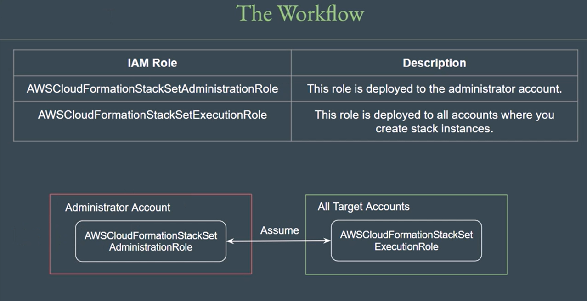

# CloudFormation - StackSets

CloudFormation StackSets basically allows us to deploy stacks across multiple AWS 
account / AWS regions from single location.

Simple Use-Case:

● AWS Config is recommended to be enabled in all regions.

● Before we had to maintain stack across each region.

● This can now be solved easily using Stack Sets

## Deployment Instruction
Two IAM Roles required:

first for the Administrator Account of StackSets

second for the Destination AWS Accounts.

Role Name for Admin Account:  AWSCloudFormationStackSetAdministrationRole

Role Name for Dest Account:      AWSCloudFormationStackSetExecutionRole

## Practical Steps

1. **Create Two IAM Roles:** `AWSCloudFormationStackSetAdministrationRole` and `AWSCloudFormationStackSetExecutionRole`.

2. `AWSCloudFormationStackSetAdministrationRole` has **permission to assume** the `AWSCloudFormationStackSetExecutionRole`.

3. `AWSCloudFormationStackSetExecutionRole` has the **necessary permissions to create resources**.

4. Create StackSets.

