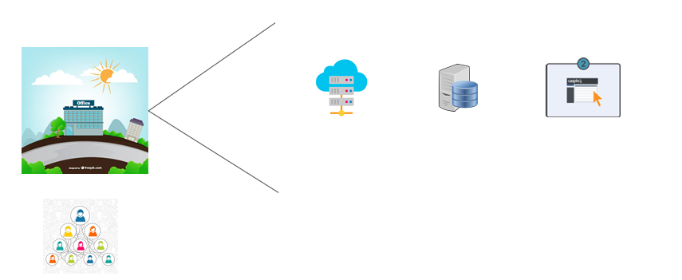

# Active Directory

## Traditional Way

## Better Way

## Active Directory
    
Active Directory is one of the most popular directory service developed by Microsoft.

The server running the Active Directory service is called as the domain computer and 
it can authenticate and authorize the users and computers which are associated to it.

