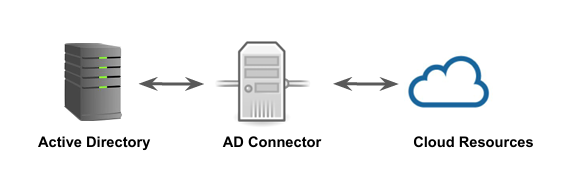

# AWS Directory Service

## Challenges with Active Directory
  
For those who have set up an AD knows, this can be a challenging and time-consuming 
process.

Some of the challenges involved can be:

- Provisioning the Infrastructure.

- Installing the directory software

- Getting replication setup between domain controllers for HA

- Monitoring / Patching and many more.

## Directory Service in the Cloud
   
AWS Directory Service is a managed service based on the cloud that allows us to create 
directories and let AWS experts handle and manage the other parts like high availability, 
monitoring, backups, recovery, and others.

There are three important components :

- Active Directory Service with Microsoft Active Directory

- Simple AD

- AD Connector

## Directory Service with Microsoft AD
 
AWS Directory Service for Microsoft Active Directory is powered by an actual Microsoft 
Windows Server Active Directory (AD) in the AWS Cloud.

There are two types:

- Standard Edition   -- For small and midsize ( up to 5000 users )

- Enterprise Edition -- For larger deployments.

## AD Connector
  
● It is a proxy service that provides easy way to connect applications in cloud to your 
existing on-premise Microsoft AD.

● When users log in to the applications, AD Connector forwards sign-in requests to your 
on-premises Active Directory domain controllers for authentication. 

## Simple AD

● Simple AD is a Microsoft Active Directory–compatible directory from AWS Directory 
Service that is powered by Samba 4.

● Simple AD supports basic Active Directory features such as user accounts, group 
memberships, joining a Linux domain or Windows based EC2 instances, Kerberos-based 
SSO, and group policies. AWS provides monitoring, daily snapshots, and recovery as part of 
the service.

● Simple AD does not support trust relationships, DNS dynamic update, schema extensions, 
multi-factor authentication, communication over LDAPS, PowerShell AD cmdlets, or FSMO 
role transfer.