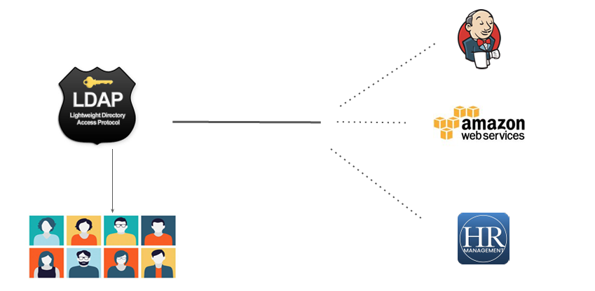
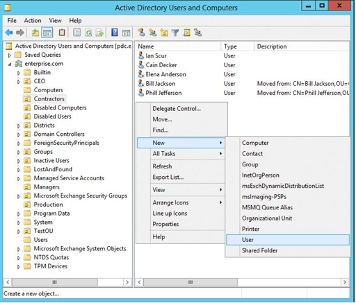
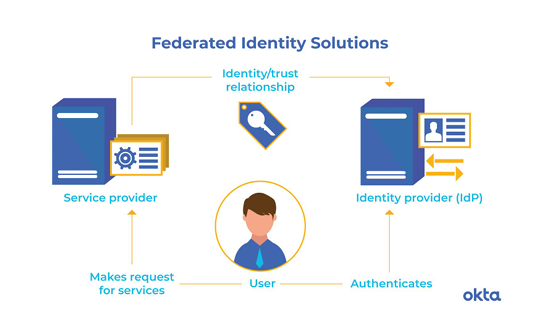
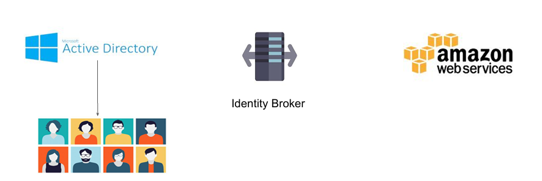

# Federation

## Understanding the Challenge

Let’s assume there are 500 users within an organization. Your organization are using 
3 services :

● AWS ( Infrastructure )
● Jenkins ( CI / CD )
● HR Activator  ( Payroll )

You have been assigned role to give users access to all 3 services.

## Storing Users Centrally

## Central Users

There are various solutions available which can store users centrally :

● Microsoft Active Directory

● RedHat Identity Management / freeIPA

## Basics of Federation - AWS Perspective

- Federation allows external identities ( Federated Users ) to have secure access in your 

- AWS account without having to create any IAM users.

## Basic Workflow

## Understanding Identity Broker

Identity Broker :

It is an intermediate service which connects multiple providers.

## Steps to Remember

● User logs in with username & Password.

● This credentials are given to the Identity Broker.

●  Identity Broker validates it against the AD.

●  If credentials are valid, Broker will contact the STS token service.

●  STS will share the following 4 things :

                   Access Key + Secret Key + Token + Duration

● User can now use to login to AWS Console or CLI.

## Notations to Remember
Identities :   Users 

 Identity Broker : 

- It is a middleware that takes the users from point A & help connect them to 
point B.

Identity Store :

- Place where users are present. Eg : AD, IPA, Facebook etc.