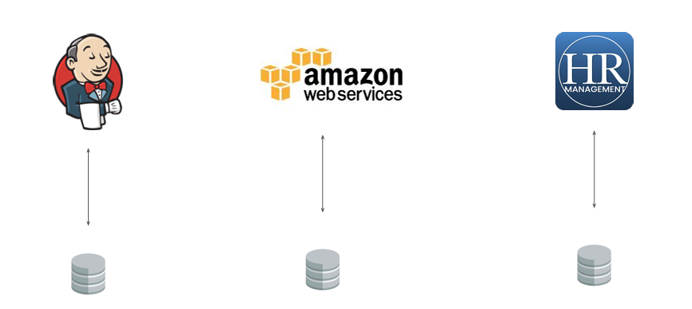
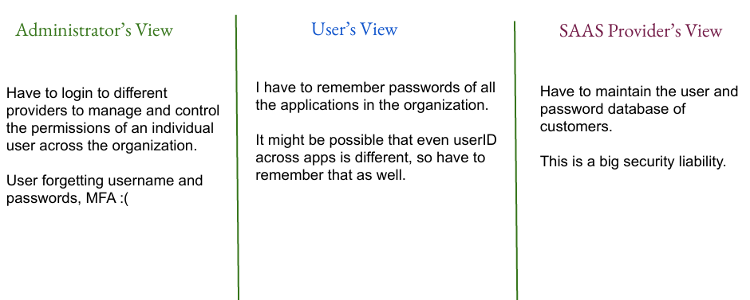
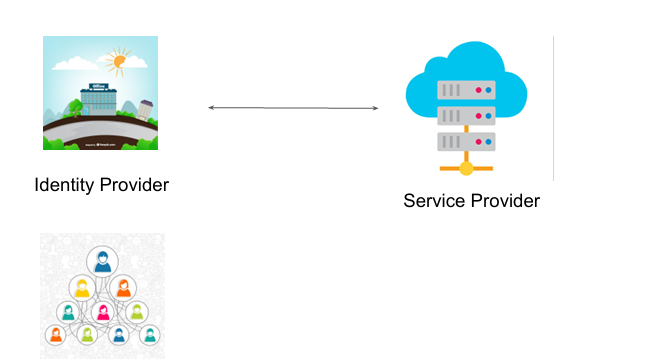
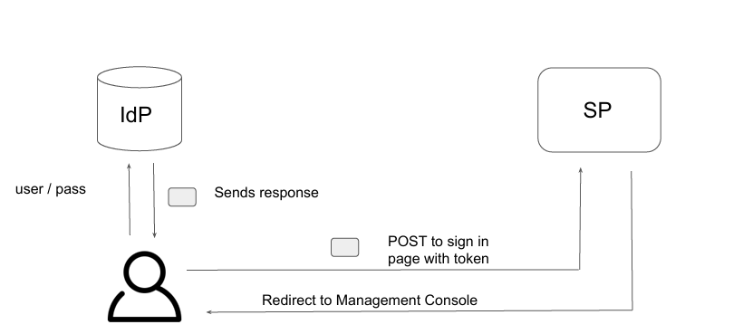

# SAML

## Introduction to SAML

● SAML stands for Security Assertion Markup Language.

● It is a secure XML based communication mechanism for communicating identities across 
organizations.

● SAML eliminates the need to maintain multiple authentication credentials, such as 
passwords in multiple locations. 

 ## Classic Way

 

## Challenges with classic way

● The administrator does not have direct visibility with the underlying database of the 
SAAS provider.

● If there are multiple SAAS providers, it is difficult to keep track of which user has access to 
which SAAS application.

● When the user leaves the organization, he needs to be removed from all the entities 
(Jenkins, AWS, HR app)

## Different Views

 

## SAML

 

## The SAML Way

 

 ## Introduction to SAML

● The flow gets initiated when user opens the IDP URL and enters the username and 
password and selects the appropriate application.

● IdP will validate the credentials and associated permissions and then user receives SAML 
assertion from the IdP as part of response.

● User does a POST of that SAML assertion to the SAAS sign in page and SP will validate 
those assertion.

● On validation, SP will construct relevant temporary credentials, and constructs sign in 
URL for the console and sends to the user.