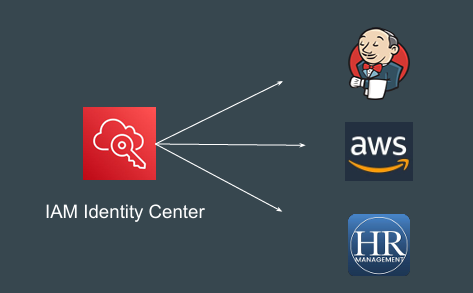
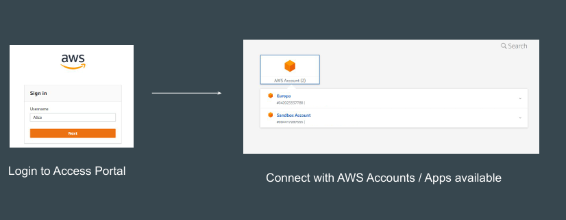
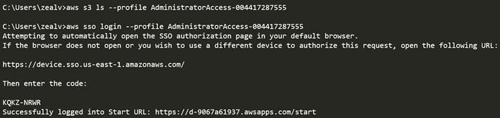

# IAM Identity Center

## Understanding the Basics
IAM Identity Center (successor to AWS Single Sign-On) allows centralized 
access to multiple AWS accounts and applications and provide users with single 
sign-on access to all their assigned accounts and applications from one place.

## Basic Steps

## Understanding the Workflow

## SSO with AWS CLI
AWS CLI integrates with the SSO.

SSO users can authenticate via CLI, and they will be able to perform the CLI 
operations without having to add keys in their ~/.aws/credentials file.

IAM  Team after implementing SSO 

## Benefits of IAM Identity Center

Your users can use their directory credentials for single sign-on access to 

- multiple AWS accounts.

- Enable single sign-on access to your AWS applications

- Enable single sign-on access to Amazon EC2 Windows instances

- Enable single sign-on access to cloud-based applications that support SAML

