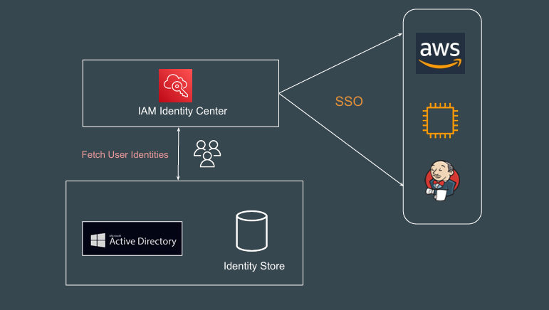
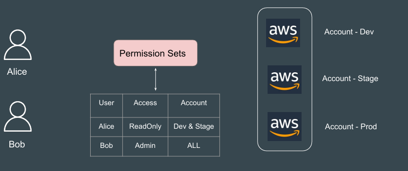
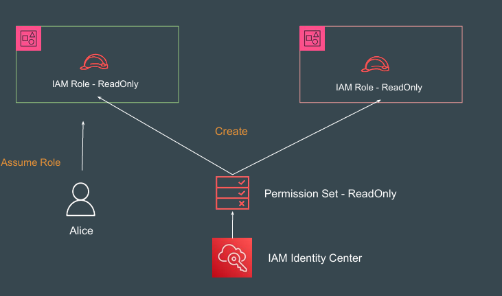

# IAM Identity Center - Concepts & Considerations

## Prerequisite for Identity Center
Your AWS account must be managed by AWS Organizations. 

If you've already set up AWS Organizations, make sure that all features are 
enabled

When you enable IAM Identity Center, you will choose whether to have AWS 
create an organization for you.

## Identity Source

If you're already managing users and groups in Active Directory or an external 
IdP, it is recommended that you consider connecting this identity source when 
you enable IAM Identity Center and choose your identity source.

You can also create users and groups directly in IAM Identity Center.

## Permission Sets

Permission sets define the level of access that users in IAM Identity Center have 
to their assigned AWS accounts

## How it Works

