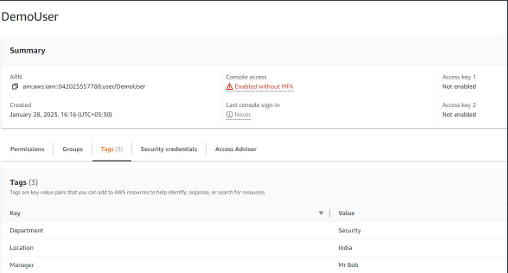
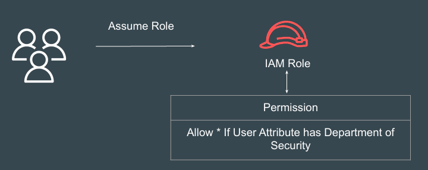
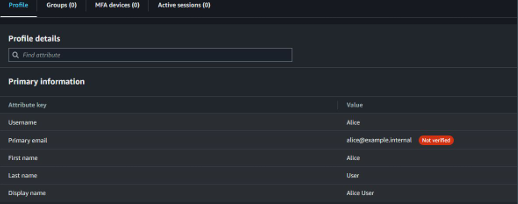
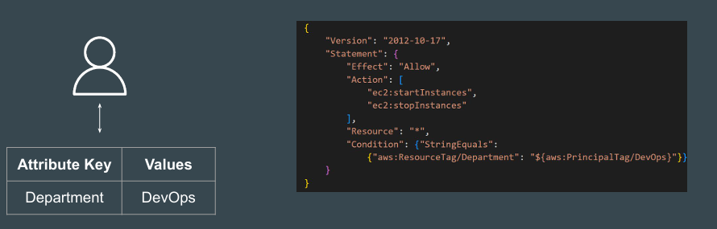

# Points to Note - IAM Identity Center

## SAML Implementation
IAM Identity Center supports identity federation with SAML (Security Assertion 
Markup Language) 2.0. 

This allows IAM Identity Center to authenticate identities from external identity 
providers (IdPs

## Attributes in IAM

You can use IAM tag key-value pairs to add custom attributes to an IAM user.

## Attribute-Based Access Control

Attribute-based access control (ABAC) is an authorization strategy that defines 
permissions based on attributes.

## How to Set Attributes?
Depending on the Identity Source, the way we set Attribute also changes.
In IAM Identity Center, we can easily set user attributes from Profile.

## Permissions Based on ABAC
Depending on the Identity Source, the way we set Attribute also changes.
In IAM Identity Center, we can easily set user attributes from Profile.

## Importance of Session Tags
Session tags are key-value pair attributes that you pass when you assume an 
IAM role or federate a user in AWS STS.

Attributes are passed as session tags. They are passed as comma-separated 
key:value pairs

