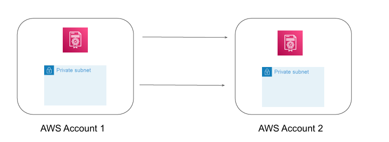

# AWS Resource Access Manager

## Overview of Resource Access Manager

AWS Resource Access Manager (AWS RAM) helps you securely share the AWS resources that 
you create in one AWS account with other AWS accounts.

