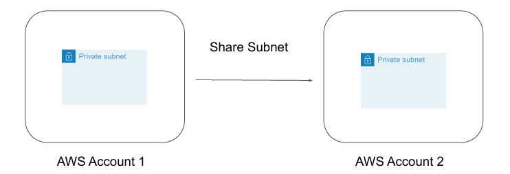

# VPC Sharing in AWS

## Understanding the Basics
VPC sharing allows multiple AWS accounts to create their application resources, such as EC2 
instances, RDS, and others into shared, centrally-managed virtual private clouds (VPCs).

In this model, the account that owns the VPC (owner) shares one or more subnets with other 
accounts (participants) that belong to the same organization from AWS Organizations.

## Important Note

VPC owners are responsible for creating, managing, and deleting the resources associated with a 
shared VPC. These include subnets, route tables, network ACLs and others.

VPC owners cannot modify or delete resources created by participants, such as EC2 instances 
and security groups

Default subnets cannot be shared.

## Billing Considerations
In a shared VPC, each participant pays for their application resources including EC2 instances, 
RDS, Lambda functions and other resources.

Participants also pay for data transfer charges associated with inter-Availability Zone data 
transfer, data transfer over VPC peering connections.

VPC owners pay hourly charges across NAT gateways, virtual private gateways, transit gateways, 
and other VPC specific central resources.