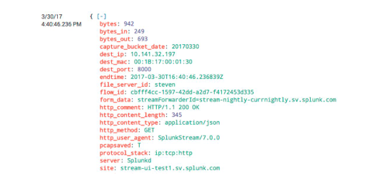
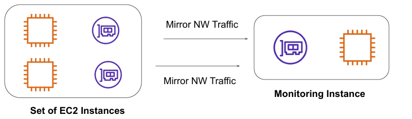

# Traffic Mirroring

## Understanding the Challenge
Many organizations use various kind of wire data collection tools like Splunk stream to capture 
specific type network traffic to analyze for security threats.
This used to impact the overall system performance. 

## Basics of Feature

Traffic Mirroring is an Amazon VPC feature that you can use to copy network traffic from an 
elastic network interface.

You can then send the traffic to out-of-band security and monitoring appliances for:

