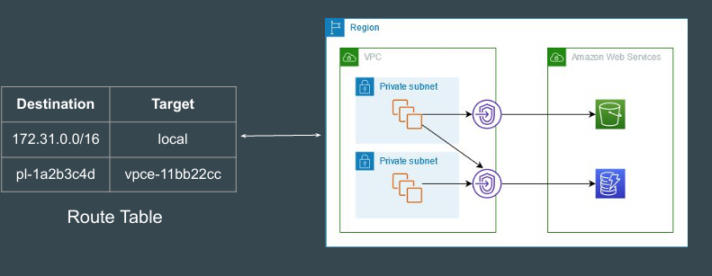
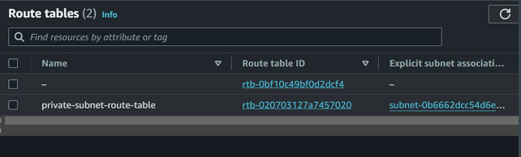
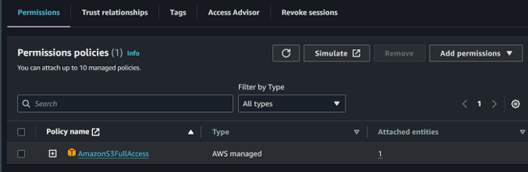
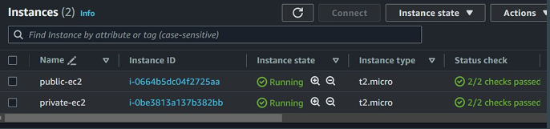
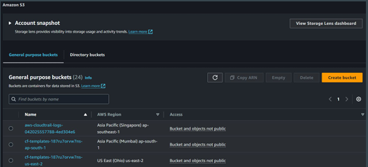
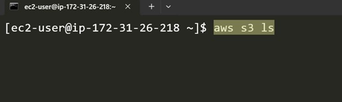
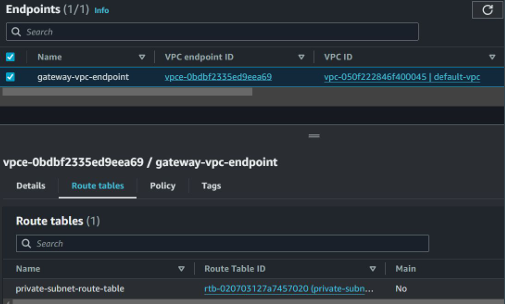
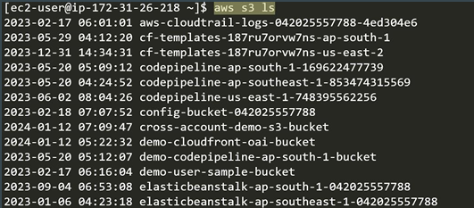

# Gateway VPC Endpoints - Practical Architecture

## Aim of this chapter

EC2 instance in private subnet should be able to connect to S3 service using 
Gateway VPC Endpoints.

## Step 1 - Private Subnet in VPC

All the subnets in Default VPC are Public by default (Has Internet Gateway route)
We will convert one subnet to Private by associating a different route table to it 
which does not have Internet Gateway association.

## Step 2 - Create IAM Role

For EC2 instance to communicate to S3 Bucket, we have to create an IAM Role 
with appropriate S3 Policy.

## Step 3 - Launch EC2 Instance 

1. We will launch EC2 instance in Private Subnet.

2. We will launch EC2 instance in Public Subnet.

## Step 4 - Create S3 Buckets for Testing

Create any random S3 bucket for testing.
If you already have any S3 bucket, you can ignore this step.

## Step 5 - Test Connectivity

1. Connect to Public EC2 Instance.

2. From Public EC2, connect to the Private EC2 instance.

Results: No S3 connectivity should be present.

## Step 6 - Create Gateway Endpoint

In this step, we will create a Gateway VPC Endpoint for S3 and associate it with 
the Private Subnet.

## Step 7 - Test Connectivity

1. Connect to Private EC2 instance using preferred way.

2. Verify if you are able to connect to S3 service.

