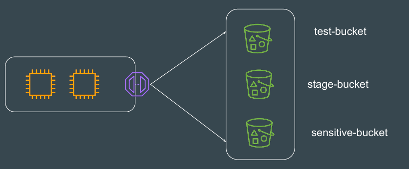
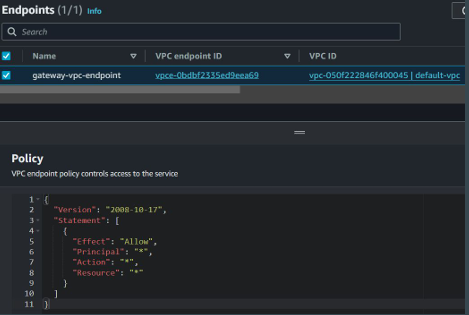
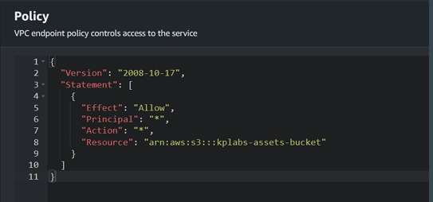
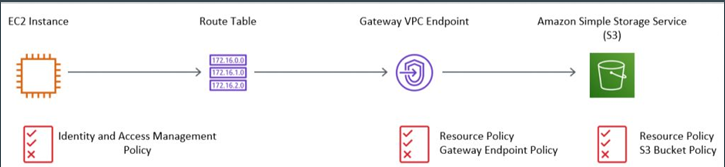

# Gateway VPC Endpoint Policies

## Understanding the Challenge
By default, Gateway VPC Endpoint will allow EC2 instances to connect to ALL 
the destination resources (S3 Buckets) [provided permissions are present]

## Default Policy of Gateway Endpoint
The access to ALL S3 buckets is allowed because of the Default Gateway 
Endpoint Policy that gets associated.

## Customization on the Policy
Based on requirements, we can customize the Gateway VPC Endpoint policy to 
allow access to only certain S3 buckets.

## Point to Remember - Policy Decision
There are multiple places in which permission can be DENIED for a resource.
IAM Policy, VPC Endpoint Policy, S3 Bucket Policy.
ONE Deny = Total Deny of Request.

